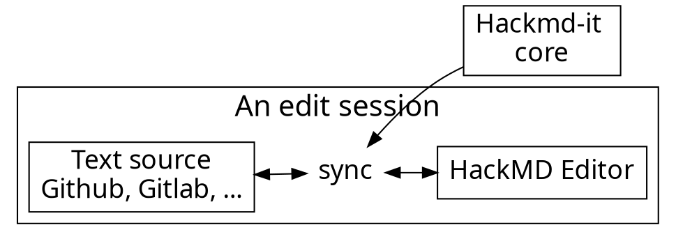

## LV-Ziele

**Aufgaben des Datenmanagements**
* Verschiedenen Datenbankarchitekturen und Funktionsprinzipien.
* Entity-Relationship(ER)-Modelle und von relationalen Datenmodelle und deren Sprachelemente.
* Erstellung eines ER-Modells auf der Basis eines Teilausschnitts der
unternehmerischen Realität ein dementsprechendes ER-Modell erstellen.
* Überführung in ein relationales Datenmodell und Implementation mit SQL-Befehlen.
* Normalisierung ein gegebenes relationales Datenmodell bis zur 3. Stufe.
* Datenaustauschformate inklusive deren Notations- und Speicherform sowie deren
Einsatzbereich und Datenübertragungsprotokolle in verteilten Systemen.
* Beschreibung von Softwarekompenenten und -architekturen
sowie deren Einsatzbereich sowie Funktionalität erläutern.

---

# Datenbanken

Referenz: UTB3_Datenanken_02_Ueberblick

---

## Grundlegende Begriffe

1. Datenbank (DB): geordnete, selbstbeschreibende Sammlung von Daten, die in Beziehung stehen.
2. Datenbanksystem (DBS): DB + Datenbank Managemensystem (DBMS) + Kommunikationsschnittstelle.

---

## "Arten" von Datenbanken

1. relationale DB: Daten liegt in Tabellen
    * Pro: schnell
    * Contra: komplexe Objektstrukturen nicht intuitiv darstellbar (z.B. Eltern-Kind, Student-Jahrgang, ...)
3. objektorienteierte DB: Daten in form von Objekten
    * Pro: Objektsturkturen intuitiv darstelbar 
    * Contra: langsam
3. objketrelationale DBMS: verbindung der Vorteile von relationalen und objektorientierten DBs

---

## Anforderungen einer Datenbank

1. Persistenz: Daten langfristig speichern
2. CRUD (Create, Read, Update, Delete): meist mit Schwerpunkt auf Read
3. Verwaltung des Datenschemas (Kontext/Relationen) der Daten

---

## Datenbankdesign

1. Konzeptionelle Modelle => Logische Struktur => Entity-Relationship-Modell => Welche Daten will ich darstellen/speichern.
2. Implemantative Modelle => Speicherstruktur => relationales Datenbankmodell => Wie will ich die Daten darstellen/speichern.

Beide Modelle sind meistens Notwendig und Sinnvoll!

---

# Datenbankentwurf 

*Referenz: UTB3Datenanken03Entwurf*

Datenbankentwurf ist ein Teil der Wirklichkeit, welche für die betriebliche Informationsverbarbeitung wichitg ist, zu beschreiben:
> A database represents some aspect of the real world, sometimes
> called the miniworld or the universe of discourse (UoD).

---

### Früher

siehe ANSI SPARC

### Heute (semantische Modellierung)


### Unterschiede


Das **Was** ist abstahiert und aus Managementsicht entscheidened.
Das **Wie** besser Experten zu überlassen ist.

Bei ANSI SPARC ist dies nicht gut getrennt --> in der semantischen Modellierung gut getrennt (Was: ER-Modell, Wie: relationales Schema).

--> das sematische Modell erleichtert Kommunikation zwischen Management und IT (für Laien lesbar und für IT eindeutig)

---

## Gutes vs Schlechtes Datenbankkonzept

Bei einem guten Datenbankkonzept geht es nicht um Entities, Tabellen, etc. sondern um reale Objekte, Informationen, Zusammenhänge, etc.
**Nicht zu technisch Denken!** und auch inhaltich abklären welche Daten zu erfassen sind.
#### User werden kreativ wenn sie:
    1. Daten nich angeben können obwohl sie wollen (Extrainformationen)
    2. Daten nicht erforderlich sind (zuviel Information notwendig)
    3. Daten fehlerhaft, doppel sind (unsinnige Informationen)

---
## Wie erstellt man ein sematisches Modell?

Entity-Relationship-Modelle nicht standardisiert --> zum Teil in gleicher Firma unterschiedliche "Dialekte"
--> Unified Modeling Language (UML) Diagramme als stndardisierte Lösung
*    Klassendiagramme
*    Objektdiagramme

---

## sematische Modellierung vorgehen

1. Daten auf klar idenifizierbare und unterscheidbare **Objekte** (sowohl der realität als auch des Denkens) durchsuchen --> Entities/Objekte
2. Untersuchung der **Beziehungen** zwischen diesen Objekten --> Relationship/Association 
    * Kann eine Zahl sein z.B. ein Kurs hat mindestens 5 und maximal 12 Teilneihmer (Kardinalität)
    * aber auch ob eine Beziehung vorhanden ist z.B. ein Student kann muss aber keinen Abschluss haben (Optionalität)
3. Untersuchung der **Eigenschaften** dieser Objeken
    * **identifizierende** Eigenschaften vs sonsitige Eigenschaften
    * Art der Eigenschaft (Typ --> z.B. Text, Zahl)
    * Wertebereich der Eigenschaft (z.B. Noten nur zwischen 1-5)
    

---

## Who am I?

- Front-end developer
- VSCode :heart: 
- I use tabs. :cat: 

---

### 70% of our users are developers. Developers :heart: GitHub.

---



---

### Usage flow

---




---

### Architecture of extension

---


---

## Content script

- Bind with each page
- Manipulate DOM
- Add event listeners
- Isolated JavaScript environment
  - It doesn't break things

---

# :fork_and_knife: 

---

<style>
code.blue {
  color: #337AB7 !important;
}
code.orange {
  color: #F7A004 !important;
}
</style>

- <code class="orange">onMessage('event')</code>: Register event listener
- <code class="blue">sendMessage('event')</code>: Trigger event

---

# :bulb: 

---

- Dead simple API
- Only cares about application logic

---

```typescript
import * as Channeru from 'channeru'

// setup channel in different page environment, once
const channel = Channeru.create()
```

---

```typescript
// in background script
const fakeLogin = async () => true

channel.answer('isLogin', async () => {
  return await fakeLogin()
})
```

<br>

```typescript
// in inject script
const isLogin = await channel.callBackground('isLogin')
console.log(isLogin) //-> true
```

---

# :100: :muscle: :tada:

---

### Wrap up

- Cross envornment commnication
- A small library to solve messaging pain
- TypeScript Rocks :tada: 

---

### Thank you! :sheep: 

You can find me on

- GitHub
- Twitter
- or email me
